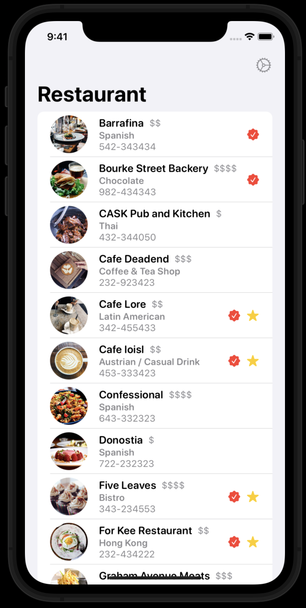
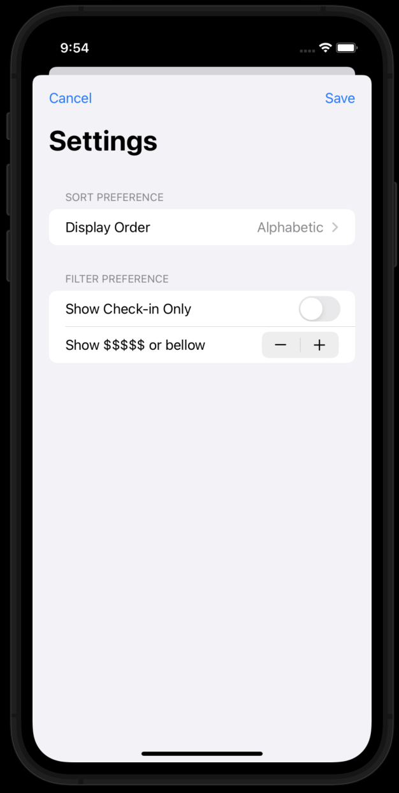

# restaurantPreferences

The aim of this small mobile app 📱 is show how to use UserDefault, as one of the choices we have when wanting to persiste small amounts of information on our phone. The app simply consist on a list of restaurants which can be modified allowing us to know whether they are one of our favourite or they can check-in. According to these parameters and its prices, the user can not only display them in alfabetical order but also filter them.

With this execercise it is easy to understand how Combine works and helps us to update our views. Whereas, learning about Combine implies knowing about EnviromentObjects, Observable protocol, @Published and @State markups.

